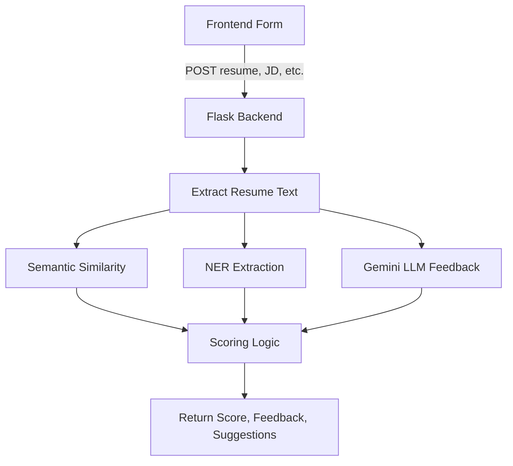

This is a [Next.js](https://nextjs.org) project bootstrapped with [`create-next-app`](https://nextjs.org/docs/app/api-reference/cli/create-next-app).

## Getting Started

First, run the development server:

```bash
npm run dev
# or
yarn dev
# or
pnpm dev
# or
bun dev
```

Open [http://localhost:3000](http://localhost:3000) with your browser to see the result.

You can start editing the page by modifying `app/page.tsx`. The page auto-updates as you edit the file.

This project uses [`next/font`](https://nextjs.org/docs/app/building-your-application/optimizing/fonts) to automatically optimize and load [Geist](https://vercel.com/font), a new font family for Vercel.

## Learn More

To learn more about Next.js, take a look at the following resources:

- [Next.js Documentation](https://nextjs.org/docs) - learn about Next.js features and API.
- [Learn Next.js](https://nextjs.org/learn) - an interactive Next.js tutorial.

You can check out [the Next.js GitHub repository](https://github.com/vercel/next.js) - your feedback and contributions are welcome!

## Deploy on Vercel

The easiest way to deploy your Next.js app is to use the [Vercel Platform](https://vercel.com/new?utm_medium=default-template&filter=next.js&utm_source=create-next-app&utm_campaign=create-next-app-readme) from the creators of Next.js.

Check out our [Next.js deployment documentation](https://nextjs.org/docs/app/building-your-application/deploying) for more details.

# InterSync

## Architecture Overview

This project uses a hybrid architecture:

- **Frontend & Main App:** Next.js (TypeScript)
- **Backend Microservice:** Python Flask (for advanced resume scoring using NLP/AI)
- **Communication:** The Next.js app communicates with the Python service via HTTP API calls.

---

## Backend Resume Scoring Workflow

### 1. Receive the Request
- The backend exposes a POST endpoint: `/api/score-resume`.
- The frontend sends a multipart/form-data request containing:
  - The resume file (PDF, DOCX, or TXT)
  - The job description (text)
  - The category (e.g., Software Engineer)
  - The experience level (e.g., Fresher, Intermediate, Experienced)

### 2. Extract Resume Text
- The backend reads the uploaded file:
  - If PDF: Uses `pdfplumber` to extract text from all pages.
  - If DOCX: Uses `python-docx` to extract text from all paragraphs.
  - If TXT: Reads the file as plain text.
- **Purpose:** Converts the resume into a string for further analysis.

### 3. Semantic Similarity (Resume vs. Job Description)
- Uses `sentence-transformers` to generate embeddings (vector representations) for both the resume text and the job description.
- Calculates the **cosine similarity** between these embeddings.
- **Purpose:** Measures how closely the resume matches the job description in meaning, not just keywords.

### 4. Named Entity Recognition (NER)
- Uses `spacy` to analyze the resume text and extract:
  - **Roles:** Job titles, organizations, and person names.
  - **Organizations:** Company names.
  - **Degrees:** Educational qualifications.
- **Purpose:** Identifies key entities in the resume for scoring.

### 5. Gemini LLM Feedback
- Sends the resume text and job description to Google Gemini (via the `google-genai` SDK) with a prompt asking for:
  - Strengths
  - Weaknesses
  - Recommendations
- The response is parsed as JSON (with fallback logic if the model returns markdown or code blocks).
- **Purpose:** Gets advanced, AI-powered feedback on the resume.

### 6. Scoring Logic
- **Normalizes** the semantic similarity score to a 0–1 range.
- **Counts**:
  - How many times the category appears in the extracted roles.
  - Number of degrees and organizations found.
- **Uses Gemini feedback**:
  - Adds points for each strength.
  - Subtracts points for each weakness.
- **Combines** all these into a final score (0–100), using weighted sums:
  - Similarity (up to 50 points)
  - Category match (10 points per match)
  - Degrees (up to 15 points)
  - Organizations (up to 10 points)
  - Gemini feedback (5 points per strength, -3 per weakness)
- **Purpose:** Produces a comprehensive, context-aware score.

### 7. Return the Result
- The backend returns a JSON response with:
  - `score`: The final resume score (0–100)
  - `strengths`: List of strengths (from Gemini)
  - `weaknesses`: List of weaknesses (from Gemini)
  - `recommendations`: List of suggestions (from Gemini)

---

### Summary Diagram



---

### Why This Workflow?
- **Combines traditional NLP (NER, similarity) with advanced LLM feedback.**
- **Scores are context-aware, not just keyword-based.**

---

## Setup Instructions

### 1. Next.js (TypeScript) App

- Usual setup: `npm install && npm run dev`
- The API route for resume scoring is in `src/app/api/score-resume/route.ts` (or similar).

### 2. Python Flask Microservice

- Go to the `backend/` folder:
  ```sh
  cd backend
  python3 -m venv venv
  source venv/bin/activate
  pip install flask flask-cors pdfplumber python-docx sentence-transformers spacy google-genai python-dotenv
  python -m spacy download en_core_web_sm
  # Add your Gemini API key to backend/.env as GEMINI_API_KEY=your-key-here
  python main.py
  ```
- The service will run at `http://127.0.0.1:8000`.

---

## Communication

- The Next.js API route sends a POST request to the Flask endpoint (e.g., `/api/score-resume`).
- The Flask service returns a JSON response with the score, strengths, weaknesses, and recommendations.

---

## Example API Call (from Next.js to Flask)

```typescript
const formData = new FormData();
formData.append('resume', file);
formData.append('jobDescription', jobDescription);
formData.append('category', category);
formData.append('experience', experience);

const response = await fetch('/api/score-resume', {
  method: 'POST',
  body: formData,
});
const data = await response.json();
```
